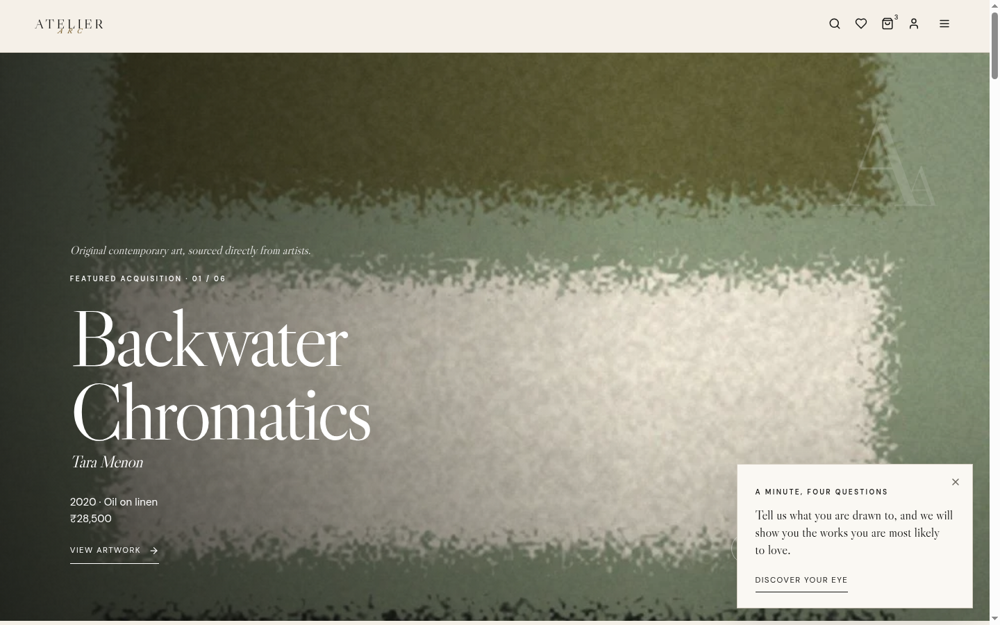
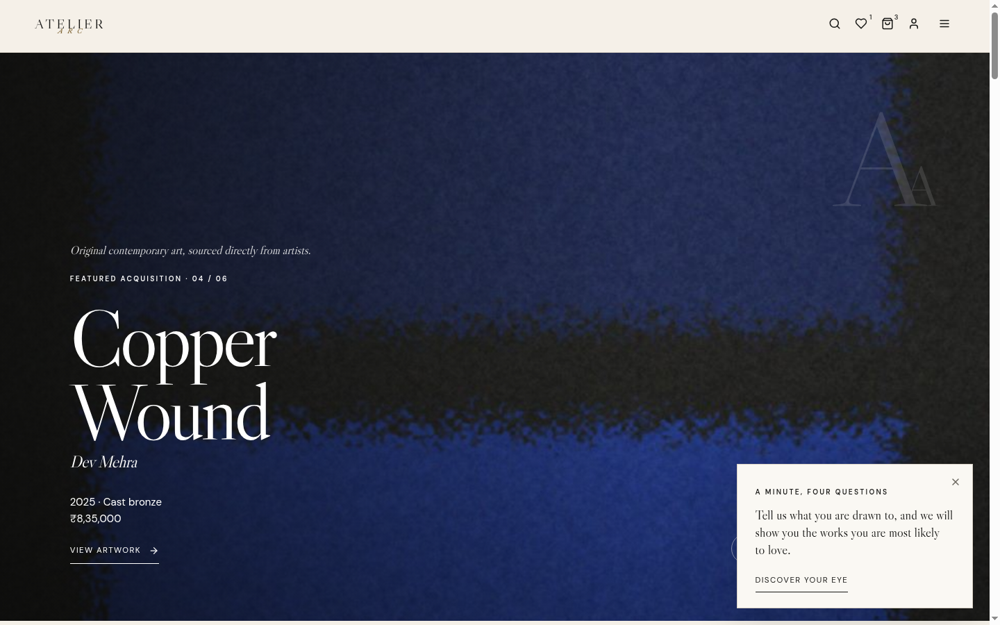

# Atelier Arc

[](https://github.com/madhav256/atelier-arc/actions/workflows/ci.yml)

Atelier Arc is a luxury contemporary art dealership platform built with React, Express, and MongoDB. It provides an editorial storefront with a curated hero carousel, a faceted catalogue, collector accounts, an advisor inquiry pipeline, a staff admin, and a checkout that runs on payment-provider adapters with server-signed quotes and webhook-only confirmation.

- **Live Demo:** [https://atelier-arc.onrender.com](https://atelier-arc.onrender.com)
- **API:** [https://atelier-arc-api.onrender.com/api/v1](https://atelier-arc-api.onrender.com/api/v1)
- **Stack:** MongoDB · Express · React 18 · Node.js · Vite · Vitest · Playwright

Both services run on Render's free tier, so the first request after an idle stretch can take up to a minute while the instance spins up. That is the hosting plan, not the app.

The interface follows an editorial gallery direction: ink on warm paper, serif display headings, restrained motion that honours `prefers-reduced-motion`, and artwork photography doing the talking.

## Screenshots





<p align="center"></p>

## Technical deep dives

Three parts of this project show how I approach engineering problems.

**Curated editorial carousel.** The homepage hero is a curated set of artworks chosen as a visual spread (palette, form, artist variety), fetched per slug in parallel with order preserved (`HERO_SLUGS` in `frontend/src/pages/Home.jsx`). Keyboard navigation is gated on the hero being in the viewport and no dialog or input holding focus; touch uses a horizontal-dominant swipe threshold.

**Same-origin session architecture.** The storefront and API deploy as separate services, which made the API's `SameSite=Lax` cookies third-party on the storefront origin; sessions, cart, and CSRF silently failed. The fix routes API traffic same-origin through a host-level rewrite (`/api/*` proxied to the API service), so every cookie is first-party. On top of that: double-submit CSRF tokens, rotating refresh tokens, and lockout on credential endpoints (`backend/src/middleware/csrf.js`, `backend/src/services/authService.js`).

**Checkout integrity.** Prices are never trusted from the client. The API issues signed shipping/insurance/GST quotes, holds inventory for a bounded window, and confirms orders only from signed provider webhooks, never from a browser redirect (`backend/src/services`, payment adapters). The declined-payment path leaves the order unpaid and the work available, and both paths are covered by the Playwright suite.

## Implemented features

### Storefront and discovery

- Editorial homepage with curated carousel, collections, and journal.
- URL-driven catalogue with facets, sorting, and typo-tolerant search.
- Artwork detail with JSON-LD, a simulated room viewer, and provenance dossier download.
- Artist and collection pages, saved works, and taste-based recommendations.
- "See it on your wall" AR dialog for wall works, using `<model-viewer>` with a true-scale GLB generated by the API from the work's dimensions and image; WebXR/Scene Viewer on Android, Quick Look on iOS. Sculpture and ceramics are not modelled.

### Accounts and collecting

- Full auth: email verification, password reset, lockout, rotating refresh tokens, CSRF.
- Server-side cart shared across devices.
- Signed shipping/insurance/GST quotes; checkout through payment adapters with inventory holds and webhook-only confirmation.
- Collector account: orders, inquiries with message thread, viewings, private offers, notifications, settings.
- Private viewings: 45-minute slots (Tuesday to Saturday, four times a day IST, at least a day ahead, up to three weeks out) at the Mumbai or New Delhi gallery or on video, with a unique index against double booking and a calendar file in the confirmation email.
- Numbered certificate of authenticity per purchased work, signed with `CERTIFICATE_SECRET`, verifiable by anyone at `/verify`.
- Returns and authenticity guarantee published at `/guarantee`; EMI on INR orders above ₹5,000 through Razorpay.

### Staff side

- Advisor inquiry pipeline with assignment and threaded replies.
- Admin CRUD for artworks, artists, and collections, image uploads, analytics, and an audit log.
- Viewing management with outcome recording at `/admin/viewings`.

## Architecture

```text
frontend (React/Vite)            backend (Express/Mongoose)
src/pages                        src/routes        versioned REST
src/components                   src/controllers   transport handling
src/lib                          src/services      business logic
                                 src/models        Mongoose schemas and indexes
                                 src/middleware    auth, validation, CSRF
```

Pages and components never call MongoDB directly. Controllers own the transport layer, services own business logic, and models own schema and indexes. End-to-end coverage lives in `e2e/` (Playwright + axe), load testing in `backend/load/`, and longer documents in `docs/`.

Provider-dependent systems are honest adapters, not fake integrations. Locally, payments use a mock gateway with signed webhooks, email is written to the console, and images are stored on disk. Real Stripe or Razorpay keys, an SMTP provider, Cloudinary, and MongoDB Atlas are free signups for the owner; see [docs/PRODUCTION_INTEGRATIONS.md](docs/PRODUCTION_INTEGRATIONS.md).

## Security and data model highlights

- Double-submit CSRF tokens on every mutating request.
- Rotating refresh tokens and lockout on credential endpoints.
- Signed quote payloads; order confirmation only from signed provider webhooks.
- Inventory holds with a bounded window so two buyers cannot purchase the same work.
- Unique index on viewing slots stops double booking.
- Certificate codes are HMAC-signed and publicly verifiable; certificate PDFs are owner-or-staff only.
- Provenance dossiers and certificates render with pdfkit in Libre Caslon (OFL, bundled in `backend/assets/fonts`).

## Current limitations

- Free-tier hosting spins down with inactivity, so cold starts are slow.
- Address validation and carrier-rated shipping are not built; shipping quotes come from the gallery's own rate table.
- AR models only flat wall works; sculpture and ceramics are not modelled.
- The simulated room view is a composite render, not a photo of your room.
- Reads are bounded rather than cursor-paginated in the catalogue and admin lists.
- No automated visual regression suite; the Playwright suite covers flows and accessibility, not pixels.

These are explicit scope boundaries, not undocumented missing routes.

## Local development

### Prerequisites

- Node.js 20.19 or newer (22 recommended).
- npm 10 or newer.
- MongoDB 7 or newer, running as a replica set (single-node is fine) so orders can use transactions.

### Install

```bash
npm install
```

### Configure environment

```bash
cp .env.example .env
```

The defaults run everything locally: mock payment gateway with signed webhooks, console email, on-disk image storage.

### Seed and run

```bash
npm run seed -w backend
npm run dev
```

Open [http://localhost:5173](http://localhost:5173). The API listens on `http://localhost:4000/api/v1` with a health check at `http://localhost:4000/health`.

The seed creates 15 fictional artists, 50 original fictional artworks, 8 collections, 10 journal stories, and local-only accounts: `admin@atelierarc.example`, `advisor@atelierarc.example`, `advisor2@atelierarc.example`, and `collector@atelierarc.example`, all with the password from `SEED_PASSWORD` (default `ChangeMe123!`). The seed refuses to run against production.

## Verification commands

```bash
npm test
npm run lint
npm run build
```

`npm test` runs 27 backend tests (including integration tests against an in-memory MongoDB replica set) plus the frontend tests.

The end-to-end suite is Playwright with axe accessibility checks (41 tests, desktop and mobile):

```bash
npx playwright install chromium   # first run only
npm run test:e2e
```

It starts its own in-memory replica set, seeded API, and Vite dev server, and does not touch your local database.

```bash
npm run test:load
```

Load test via autocannon against a running, seeded API; see [docs/LOAD_TEST.md](docs/LOAD_TEST.md).

CI (GitHub Actions, `.github/workflows/ci.yml`) runs lint, tests, build, the dependency audit gate, SBOM generation, and the Playwright suite on every push and pull request.

## Documentation map

- [ARCHITECTURE.md](docs/ARCHITECTURE.md) - runtime architecture and request flow.
- [API.md](docs/API.md) - REST surface.
- [DEPLOYMENT.md](docs/DEPLOYMENT.md) - Render deployment.
- [PRODUCTION_INTEGRATIONS.md](docs/PRODUCTION_INTEGRATIONS.md) - switching payments, email, storage, and database providers.
- [runbooks/](docs/runbooks/README.md) - deploy, rollback, incident response, payments, backup and restore, secret rotation, staff access.
- [MOTION.md](docs/MOTION.md) - motion system.
- [LOAD_TEST.md](docs/LOAD_TEST.md) - load test setup.
- [SECURITY_AUDIT.md](docs/SECURITY_AUDIT.md) - dependency audit and SBOM.
- [FINAL_AUDIT.md](docs/FINAL_AUDIT.md) - pre-release audit.
